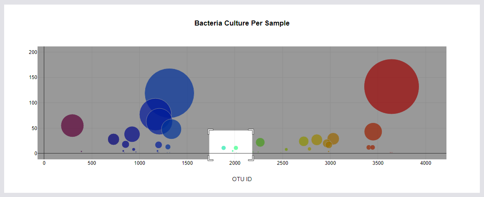
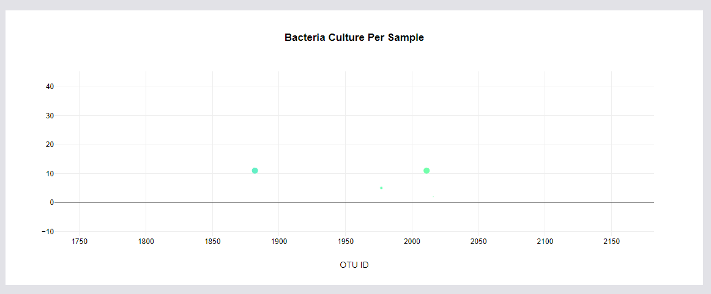

# plotly_chart

## Overview of Project
This project focuses on building an interactive dashboard to visualize the bacterial species living in the navel of candidates of a research about meat protein synthesis from human bacteria.

 

### Resources
- Data Sources: &nbsp; [Belly Button Sample Data](samples.json)
- Work Environment : &nbsp; HTLM,&nbsp; CSS,&nbsp; Java Script,&nbsp; Bootstrap 3.3.7,&nbsp; [Plotly.js](https://plotly.com/javascript/getting-started/)

 

### Link to website
Visit the website: &nbsp; https://mousavilaleh.github.io/BellyButton/

  

## Summary

By selectig the test ID charts show the data.

 

 
 
You can focus on specific area ba dragging the mouse on that, and double-click will return you too normal size of the chart.

 

 

 
