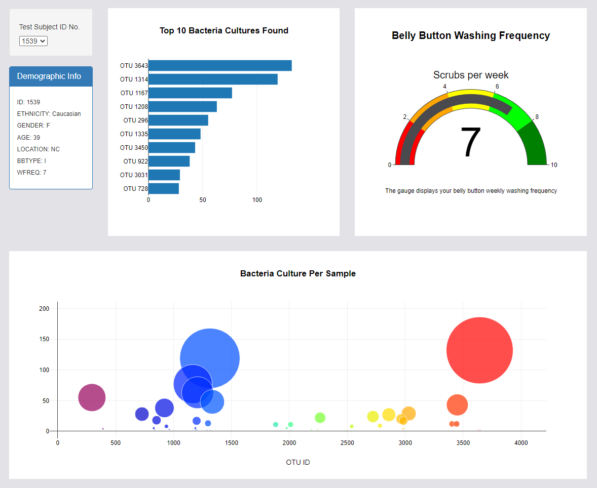

# plotly_chart

## Overview of Project
This project focuses on building an interactive dashboard to visualize the bacterial species living in the navel of candidates of a research about meat protein synthesis from human bacteria.

 

### Resources
- Data Sources: &nbsp; [Belly Button Sample Data](samples.json)
- Work Environment : &nbsp; HTLM, CSS, Java Script, Bootstrap 3.3.7

 

### Link to website
Visit the website: &nbsp; https://mousavilaleh.github.io/BellyButton/

## Summary

By selectig the testID charts show the data.
 

